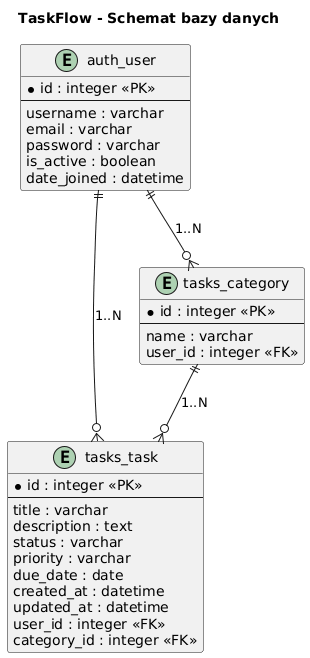
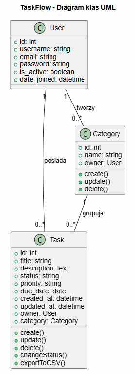
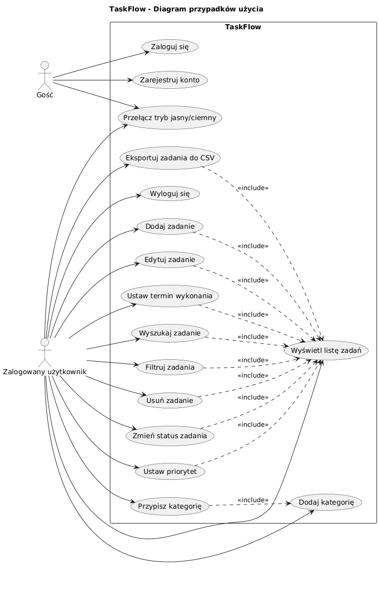

# TaskFlow - ToDo App (Django + Docker)

## Spis treści
- [Opis projektu](#opis-projektu)
- [Architektura i stos technologiczny](#architektura-i-stos-technologiczny)
- [Uruchomienie i wdrożenie aplikacji](#uruchomienie-i-wdrozenie-aplikacji)
- [Baza danych](#baza-dných)
- [Struktura projektu](#struktura-projektu)
- [Funkcjonalności](#funkcjonalnosci)
- [Testowanie i Weryfikacja Aplikacji – Podsumowanie UAT](#testowanie-i-weryfikacja-aplikacji--podsumowanie-uat)
- [Autorzy](#autorzy)

---

## Opis projektu

**TaskFlow** to zaawansowana aplikacja webowa typu **ToDo** służąca do efektywnego zarządzania zadaniami, zaprojektowana i zaimplementowana w oparciu o wysokopoziomowy framework **Django** oraz architekturę **MTV (Model-Template-View)**. Głównym celem systemu jest dostarczenie użytkownikowi intuicyjnego, wydajnego i bezpiecznego narzędzia do organizacji codziennych aktywności, optymalizacji procesów planowania oraz bieżącego monitorowania statusu prac.

Aplikacja realizuje pełen cykl obsługi danych w ramach paradygmatu **CRUD** (Create, Read, Update, Delete), umożliwiając użytkownikom nie tylko podstawowe operacje na zadaniach, ale również ich zaawansowaną kategoryzację słownikową. Wbudowany moduł wyszukiwania pełnotekstowego oraz elastyczne mechanizmy filtrowania wielokryterialnego pozwalają na błyskawiczną selekcję informacji. Dodatkowo system został wyposażony w asynchroniczny podsystem raportowania generujący ustrukturyzowane pliki płaskie w formacie **CSV**, co umożliwia dalszą analitykę danych w zewnętrznych arkuszach kalkulacyjnych. Komfort użytkowania oraz wysoki standard UX zapewnia interaktywny system komunikatów zwrotnych (**flash messages**), który w czasie rzeczywistym powiadamia operatora o wynikach podjętych akcji (np. udanej walidacji, zapisie zmian czy błędach systemowych).

Całość środowiska deweloperskiego, testowego oraz produkcyjnego została w pełni skonteneryzowana przy użyciu platformy **Docker** oraz narzędzia orkiestracji **Docker Compose**. Takie podejście gwarantuje całkowitą izolację zależności aplikacyjnych od systemu operacyjnego maszyny hosta, eliminuje problemy konfiguracyjne (*"działa u mnie"*) oraz zapewnia stuprocentową powtarzalność i spójność środowiskową. Dzięki temu proces wdrożenia (Deployment) sprowadza się do uruchomienia pojedynczej komendy, niezależnie od docelowej platformy systemowej.

---

## Architektura i stos technologiczny

Konstrukcja systemu opiera się na stabilnych, bezpiecznych i powszechnie uznanych technologiach branżowych, które zapewniają optymalną wydajność architektury monolitycznej:

* **Język programowania – Python 3:** Główny fundament logiczny aplikacji. Wykorzystanie nowoczesnych standardów języka Python zapewnia wysoką czytelność kodu źródłowego, łatwość jego konserwacji oraz pełne wsparcie dla asynchronicznego przetwarzania danych.
* **Framework backendowy – Django:** Wykorzystuje architekturę **MTV (Model-Template-View)**, która precyzyjnie separuje warstwę logiki biznesowej od prezentacji:
    * **Model:** Warstwa danych zarządzana przez potężny, wbudowany system **Django ORM (Object-Relational Mapping)**, który mapuje obiekty języka Python na tabele relacyjne bez konieczności ręcznego pisania zapytań SQL.
    * **Template:** Dynamiczne szablony prezentacji przetwarzane po stronie serwera przed wysłaniem dokumentu do przeglądarki.
    * **View:** Centralny kontroler odpowiedzialny za routing, przetwarzanie żądań HTTP, egzekwowanie logiki biznesowej oraz komunikację z warstwą danych.
* **Baza danych – SQLite3:** Zintegrowany, bezserwerowy silnik relacyjny bazujący na plikach lokalnych. Stanowi idealne, lekkie rozwiązanie dla środowiska deweloperskiego i testów UAT, gwarantując pełną zgodność z zasadami **ACID** (Atomicity, Consistency, Isolation, Durability) oraz natychmiastowy dostęp do struktur danych bez narzutu sieciowego.
* **Infrastruktura i konteneryzacja (Docker & Docker Compose):** * **Docker:** Izoluje aplikację wewnątrz lekkiego kontenera zawierającego wyłącznie niezbędne pakiety systemowe i biblioteki runtime.
    * **Docker Compose:** Definiuje architekturę usług, zarządza sieciami wewnętrznymi, konfiguruje zmienne środowiskowe oraz mapuje wolumeny (`volumes`), co pozwala na synchronizację kodu źródłowego z maszyną dewelopera w trybie *live-reload*.
* **Warstwa prezentacji (Frontend):** Natywne szablony **Django Templates** ściśle zintegrowane z semantycznym kodem **HTML5** oraz kaskadowymi arkuszami stylów **CSS3**. Architektura frontendu została zoptymalizowana pod kątem szybkiego renderowania po stronie serwera (SSR - Server-Side Rendering) oraz pełnej responsywności (RWD), zapewniając prawidłowe skalowanie interfejsu zarówno na ekranach stacji roboczych, jak i urządzeń mobilnych.

---

## Uruchomienie i wdrożenie aplikacji

### Wymagania systemowe (Prerequisites)

Przed przystąpieniem do procedury inicjalizacji środowiska należy upewnić się, że maszyna hosta spełnia następujące wymagania techniczne:
- **System operacyjny:** Każda platforma wspierająca konteneryzację natywną lub warstwę wirtualizacji: Microsoft Windows (zalecane z technologią WSL 2), macOS (Apple Silicon/Intel) lub dystrybucje systemu Linux (Ubuntu, Debian, Fedora itp.).
- **Docker Engine / Docker Desktop:** Wersja stabilna wspierająca nowoczesną specyfikację plików konfiguracyjnych Compose.
- **Docker Compose:** Narzędzie CLI zintegrowane z głównym silnikiem Dockera (wywoływane jako podkomenda `docker compose`).

### Procedura uruchomienia i rozruchu (Deployment)

W celu automatycznego zbudowania obrazu aplikacyjnego oraz uruchomienia kontenera w izolowanej sieci wewnętrznej, należy otworzyć terminal (np. PowerShell, Bash, Zsh) w głównym katalogu projektu i wykonać następujące polecenie orkiestracyjne:

```bash
docker compose up --build
```

Aby zatrzymać działającą aplikację (kontenery), w innym oknie terminala wykonaj polecenie:

```bash
docker compose down
```

*Wskazówka: W pliku `docker-compose.yml` skonfigurowano mapowanie wolumenów (`- .:/app`). Oznacza to, że modyfikacje kodu wykonywane lokalnie na Twoim komputerze są natychmiast odzwierciedlane w kontenerze, bez konieczności ponownego budowania obrazu.*

### Dostęp do interfejsu graficznego aplikacji

Po poprawnym przejściu procedury startowej i zainicjalizowaniu serwera deweloperskiego wewnątrz środowiska Docker, aplikacja webowa rozpoczyna nasłuchiwanie żądań HTTP. Interfejs użytkownika staje się w pełni dostępny z poziomu dowolnej przeglądarki internetowej pod lokalnym adresem sieciowym:

```http
[http://127.0.0.1:8000/](http://127.0.0.1:8000/)
```

### Automatyzacja procesów wewnątrz kontenera (Cykl życia)

Podczas wywołania procedury rozruchu, demon Dockera oraz wewnętrzne skrypty startowe wykonują sekwencyjnie szereg automatycznych operacji. Proces ten dzieli się na dwie główne fazy: **budowanie środowiska (Build Time)** oraz **inicjalizację operacyjną (Run Time)**.

#### Faza I: Budowanie środowiska (Build Time)
1. **Budowanie obrazu aplikacji Django:** Silnik Dockera analizuje instrukcje zaimplementowane w pliku `Dockerfile`. Pobierany jest oficjalny, stabilny i zoptymalizowany pod kątem wydajności obraz bazowy systemu Linux z preinstalowanym środowiskiem wykonawczym Python. Następnie wewnątrz obrazu tworzona jest dedykowana struktura katalogów roboczych aplikacji.
2. **Instalacja zależności z pliku `requirements.txt`:** Wewnątrz nowo tworzonego obrazu uruchamiany jest menedżer pakietów `pip`. Analizuje on plik manifestu `requirements.txt`, po czym automatycznie pobiera i kompiluje framework Django oraz wszystkie wymagane biblioteki zewnętrzne. Operacja ta podlega mechanizmowi keszowania warstw Dockera – oznacza to, że przy kolejnych uruchomieniach faza ta wykonywana jest asynchronicznie w ułamku sekundy, o ile struktura pliku z zależnościami nie uległa zmianie.

#### Faza II: Inicjalizacja i uruchomienie (Run Time)
3. **Wykonanie migracji bazy danych:** Tuż przed fizycznym podniesieniem serwera, system uruchamia automatyczne skrypty sprawdzające stan struktur danych (`python manage.py migrate`). System mapowania obiektowo-relacyjnego (Django ORM) analizuje pliki migracyjne podaplikacji w poszukiwaniu nowych modeli (np. struktur zadań czy kategorii) i automatycznie generuje lub aktualizuje odpowiednie tabele w pliku bazy danych `db.sqlite3`. Gwarantuje to pełną spójność i integralność schematu relacyjnego przy każdym rozruchu kontenera.
4. **Uruchomienie serwera aplikacji:** Ostatnim etapem cyklu startowego jest wywołanie głównego procesu kontenera (Entrypoint). Serwer deweloperski Django zostaje uruchomiony w trybie ciągłego nasłuchiwania na interfejsie sieciowym `0.0.0.0:8000`. Taka konfiguracja pozwala odizolowanemu kontenerowi poprawnie przyjmować i procesować żądania HTTP przekazywane z systemu operacyjnego maszyny hosta, zapewniając pełną, płynną interakcję z aplikacją z poziomu przeglądarki.

---

## Baza danych

Aplikacja wykorzystuje relacyjny model składowania danych zarządzany przez silnik **SQLite**. Jest to bezserwerowe, wbudowane rozwiązanie, które przechowuje całą strukturę oraz rekordy w jednym pliku binarnym bezpośrednio w katalogu roboczym projektu.

* **Lokalizacja i zarządzanie plikiem bazy:** Baza danych fizycznie odkłada się w pliku `db.sqlite3` zlokalizowanym w głównym katalogu repozytorium. Dostęp do pliku i operacje wejścia/wyjścia (I/O) są w pełni kontrolowane przez warstwę abstrakcji Django ORM (Object-Relational Mapping).
* **Automatyzacja schematu (Migracje):** Architektura tabel, typy kolumn oraz więzy integralności relacyjnej są definiowane bezpośrednio w kodzie Pythona jako klasy modeli. Proces translacji kodu na język bazy danych (migracje) jest wywoływany automatycznie na poziomie kontenera Docker przy każdym rozruchu środowiska (`python manage.py migrate`). Gwarantuje to spójność strukturalną i eliminuje konieczność ręcznego administrowania bazą.
* **Charakterystyka relacji:** Struktura bazy danych została znormalizowana i opiera się na relacjach jeden-do-wielu ($1 \rightarrow 0..*$), zapewniając pełną integralność referencyjną (mechanizmy kluczy obcych `Foreign Key` z kaskadowym usuwaniem powiązań).

### Schemat relacyjny bazy danych

Poniższy schemat bazy danych przedstawia fizyczną implementację tabel w bazie danych SQLite. Odzwierciedla on standardowe tabele generowane przez system autentykacji Django (`auth_user`) oraz dedykowane tabele biznesowe aplikacji (`tasks_category` oraz `tasks_task`), wraz z mapowaniem kluczy głównych (PK) i obcych (FK).



### Diagram klas UML

Diagram klas przedstawia logiczną strukturę obiektową aplikacji. Definiuje on trzy główne encje systemu (`User`, `Category`, `Task`) wraz z ich atrybutami (typami danych), modyfikatorami dostępu (wszystkie metody i właściwości są publiczne `+`) oraz metodami realizującymi kluczowe operacje biznesowe, takie jak zmiana statusu czy eksport zestawień.



---

## Struktura projektu

```text
todo/
│
├── tasks/                  # Aplikacja Django (logika biznesowa)
├── todo/                   # Główny moduł konfiguracyjny projektu
├── templates/              # Globalne szablony widoków HTML
├── static/                 # Zasoby statyczne aplikacji (CSS, obrazy)
│
├── Dockerfile              # Instrukcja budowania obrazu kontenera
├── docker-compose.yml      # Konfiguracja orkiestracji i wolumenów Docker
├── requirements.txt        # Lista zależności i bibliotek Python
└── db.sqlite3              # Plik relacyjnej bazy danych SQLite
```

---

## Funkcjonalności

System udostępnia pełen zestaw funkcji biznesowych i operacyjnych, podzielonych na moduły odpowiedzialne za zarządzanie tożsamością, przetwarzanie danych zadań oraz interakcję z użytkownikiem.

* **Autentykacja i autoryzacja (Identity & Access Management):** Kompleksowy podsystem bezpieczeństwa zapewniający pełną kontrolę dostępu do zasobów aplikacji. Obejmuje moduł rejestracji nowych kont z walidacją unikalności danych, bezpieczny proces logowania (uwierzytelnianie oparte na sesjach – *session-based authentication*) oraz procedurę niszczenia sesji podczas wylogowania. System gwarantuje pełną izolację danych – zalogowany użytkownik ma dostęp wyłącznie do obiektów, których jest jawnym właścicielem.
* **Moduł zarządzania zadaniami (CRUD Lifecycle):** Rdzeń aplikacyjny realizujący pełny cykl życia zadań (Create, Read, Update, Delete). Użytkownik końcowy ma możliwość inicjalizacji nowego zadania, podglądu jego szczegółowych parametrów, dynamicznej edycji (modyfikacja nazwy, opisu, priorytetu czy terminów wykonania) oraz trwałego usuwania rekordów z bazy danych.
* **Podsystem kategoryzacji słownikowej:** Funkcjonalność umożliwiająca elastyczne klastrowanie i strukturyzację pracy. Użytkownicy mogą definiować własne kategorie (słowniki), które następnie służą jako klucze klasyfikacyjne dla zadań. Rozwiązanie to ułatwia priorytetyzację procesów i porządkowanie przestrzeni roboczej.
* **Zaawansowany silnik wyszukiwania i filtrowania (Query Engine):** Narzędzie analityczne pozwalające na natychmiastowe przeszukiwanie zasobów. Wykorzystuje mechanizmy filtrowania wielokryterialnego (np. selekcja po kategoriach lub statusach) oraz wyszukiwanie pełnotekstowe (szukanie fraz kluczowych w polach tekstowych tytułów i opisów), optymalizując pracę z dużą ilością rekordów.
* **Moduł integracji i eksportu danych (Reporting Engine):** Wbudowany komponent raportujący, który umożliwia transformację danych relacyjnych do formatu pliku płaskiego **CSV**. Użytkownik może wygenerować i pobrać ustrukturyzowany arkusz zawierający aktualne zestawienie zadań, co pozwala na migrację danych lub ich zewnętrzną obróbkę analityczną.
* **System komunikatów i powiadomień (Flash Messages):** Komponent poprawiający doświadczenie użytkownika (UX) poprzez serwowanie asynchronicznych powiadomień zwrotnych renderowanych po stronie serwera. Informuje operatora w czasie rzeczywistym o powodzeniu lub błędach wykonywanych operacji (np. pomyślny zapis formularza, alert o usunięciu zadania czy błędy walidacji danych wejściowych).

### Diagram przypadków użycia

Poniższy diagram przypadków użycia ilustruje granice systemu **TaskFlow** oraz interakcje zachodzące pomiędzy aktorami (*Gość*, *Zalogowany użytkownik*) a poszczególnymi funkcjonalnościami aplikacji. Zależności typu `<<include>>` precyzyjnie wskazują operacje cząstkowe, które są obligatoryjnie wywoływane przez system w celu poprawnej realizacji nadrzędnego celu biznesowego (np. konieczność wywołania widoku listy zadań podczas filtrowania, wyszukiwania czy edycji).



---

## Testowanie i Weryfikacja Aplikacji – Podsumowanie UAT

### Cel i zakres testów
Testy miały charakter **manualny (User Acceptance Testing - UAT)** i zostały przeprowadzone z perspektywy użytkownika końcowego. Celem było potwierdzenie stabilności systemu, weryfikacja poprawności logiki biznesowej oraz integracji ze skonteneryzowanym środowiskiem Docker.

#### Zakres weryfikacji objął 6 kluczowych obszarów:
* **Moduł tożsamości:** Rejestracja nowych kont, autentykacja (logowanie/wylogowanie) oraz ochrona zasobów przed nieautoryzowanym dostępem.
* **Zarządzanie zadaniami (CRUD):** Pełny cykl życia zadań (tworzenie, odczyt, edycja atrybutów, usuwanie).
* **Kategoryzacja:** Przypisywanie zadań do kategorii oraz filtrowanie widoków słownikowych.
* **Wyszukiwanie:** Przeszukiwanie pełnotekstowe fraz kluczowych na liście zadań.
* **Eksport danych:** Generowanie raportów do formatu CSV oraz kontrola struktury danych wyjściowych.
* **Interfejs użytkownika (UI/UX):** Czytelność powiadomień systemowych (flash messages) oraz responsywność interfejsu.

### Środowisko i dane testowe
* **Środowisko uruchomieniowe:** Lokalna instancja deweloperska aplikacji Django w kontenerze Docker, zintegrowana z plikową bazą danych SQLite3.
* **Profil testowy:** Dedykowane konto użytkownika `testuser`.
* **Dane testowe:** Scenariusze realizowane na zadaniu testowym z przypisaną kategorią *"Studia"* (w toku testów zmodyfikowaną na *"Projekt"*).

### Wyniki testów zbiorczych

Wszystkie z **16 zaplanowanych przypadków testowych** zakończyły się wynikiem **pozytywnym (PASSED)**.

| Identyfikator testów | Obszar funkcjonalny | Zakres weryfikacji | Status |
| :--- | :--- | :--- | :---: |
| **T01 – T04** | Autentykacja & Sesja | Rejestracja konta, logowanie poprawnymi/błędnymi danymi, wylogowanie z systemu. | **Pozytywny** |
| **T05 – T08** | Zarządzanie zadaniami (CRUD) | Dodawanie zadań, walidacja pól formularza, edycja parametrów oraz usuwanie rekordów. | **Pozytywny** |
| **T09 – T11** | Wyszukiwanie & Filtry | Selekcja po kategoriach, wyszukiwanie pełnotekstowe, obsługa pustych list wynikowych. | **Pozytywny** |
| **T12 – T13** | Eksport danych | Generowanie pliku raportu CSV oraz kontrola poprawności nagłówków i zawartości kolumn. | **Pozytywny** |
| **T14 – T15** | Interfejs użytkownika (UI) | Wyświetlanie komunikatów flash po akcjach użytkownika, responsywność ekranu. | **Pozytywny** |
| **T16** | Bezpieczeństwo | Izolacja danych (użytkownik ma dostęp wyłącznie do własnych zadań i kategorii). | **Pozytywny** |

### Wnioski i rekomendacje

* **Status stabilności:** Aplikacja działa stabilnie, a wszystkie kluczowe procesy biznesowe i integracyjne są realizowane bezbłędnie. Dane poprawnie odkładają się w bazie SQLite3 i są bezpiecznie izolowane pomiędzy kontami.
* **Gotowość wdrożeniowa:** System w pełni spełnia kryteria akceptacji postawione w ramach sprintów deweloperskich i jest gotowy do podstawowego użytku produkcyjnego.
* **Rekomendacje QA na przyszłość:** W celu zapewnienia bezpiecznego rozwoju kodu w kolejnych iteracjach, zaleca się rozbudowanie systemu o automatyczne testy jednostkowe (Unit Tests) oraz testy integracyjne (Integration Tests).

---

## Autorzy

Projekt wykonany w ramach nauki pracy z metodyką Scrum. 

1. Uladzislau Beliakou
2. Patryk Bieniaszek
3. Mirosław Kitowski
4. Daria Panchenko
5. Łukasz Rosicki
6. Marta Starek-Piasny
7. Ryszard Wasilewski
